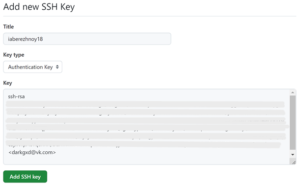
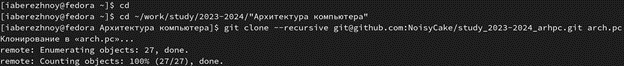

---
## Front matter
title: "Отчёт по лабораторной работе №2"
subtitle: "Дисциплина: Архитектура компьютера"
author: "Бережной Иван Александрович"

## Generic otions
lang: ru-RU
toc-title: "Содержание"

## Bibliography
bibliography: bib/cite.bib
csl: pandoc/csl/gost-r-7-0-5-2008-numeric.csl

## Pdf output format
toc: true # Table of contents
toc-depth: 2
lof: true # List of figures
lot: true # List of tables
fontsize: 13pt
linestretch: 1.5
papersize: a4
documentclass: scrreprt
## I18n polyglossia
polyglossia-lang:
  name: russian
  options:
	- spelling=modern
	- babelshorthands=true
polyglossia-otherlangs:
  name: english
## I18n babel
babel-lang: russian
babel-otherlangs: english
## Fonts
mainfont: PT Serif
romanfont: PT Serif
sansfont: PT Sans
monofont: PT Mono
mainfontoptions: Ligatures=TeX
romanfontoptions: Ligatures=TeX
sansfontoptions: Ligatures=TeX,Scale=MatchLowercase
monofontoptions: Scale=MatchLowercase,Scale=0.9
## Biblatex
biblatex: true
biblio-style: "gost-numeric"
biblatexoptions:
  - parentracker=true
  - backend=biber
  - hyperref=auto
  - language=auto
  - autolang=other*
  - citestyle=gost-numeric
## Pandoc-crossref LaTeX customization
figureTitle: "Рис."
tableTitle: "Таблица"
listingTitle: "Листинг"
lofTitle: "Список иллюстраций"
lotTitle: "Список таблиц"
lolTitle: "Листинги"
## Misc options
indent: true
header-includes:
  - \usepackage{indentfirst}
  - \usepackage{float} # keep figures where there are in the text
  - \floatplacement{figure}{H} # keep figures where there are in the text
---

# Цель работы

Целью работы является изучить идеологию и применение средств контроля версий. Приобрести практические навыки по работе с системой git.

# Задание

1. Настройка github
2. Базовая настройка github
3. Создание SHH ключа
4. Создание рабочего пространства и репозитория курса на основе шаблона
5. Создание репозитория курса на основе шаблона
6. Настройка каталога курса
7. Задание для самостоятельной работы

# Выполнение лабораторной работы

## Настройка GitHub
Перейдём на сайт https://github.com/. Справа вверху нажмём кнопку «sign up» и пройдём регистрацию (рис. @fig:001).

{ #fig:001 width=70% }

## Базовая настройка git

Откроем терминал и укажем имя и email владельца репозитория с помощью следующих комманд: (рис. @fig:002).

{ #fig:002 width=70% }

Далее настроим utf-8 в выводе сообщений git для корректного отображения символов, а также зададим имя начальной ветки (master) и параметры autocrlf и safecrlf (рис. @fig:003).

{ #fig:003 width=70% }

## Создание SSH ключа

Сгенерируем пару ключей (приватный и открытый). Для этого введём команду ssh-keygen -C "Ivan Berezhnoy <darkgxd@vk.com>". Ключи автоматически сохранятся в каталоге ~/.ssh/ (рис. @fig:004).

{ #fig:004 width=70% }

Скопируем сгенерированный открытый ключ с помощью команды cat и утилиты xclip (рис. @fig:005).

{ #fig:005 width=70% }

Зайдём на сайт GitHub под своей учётной записью, перейдём в настройки, далее в меню «SSH and GPG keys», нажмём на кнопку «New SSH key». Теперь можем вставить скопированный ключ в соответствующую строку, также укажем имя ключа (рис. @fig:006).

{ #fig:006 width=70% }

## Создание рабочего пространства и репозитория курса на основе шаблона

Будем придерживаться структуре рабочего пространства. Для этого перейдём в терминал и создадим иерархию каталогов для предмета «Архитектура компьютера» командой mkdir с ключом -p (рис. @fig:007).

{ #fig:007 width=70% }

## Создание репозитория курса на основе шаблона

Снова откроем браузер и перейдём к репозиторию с шаблоном курса по адресу https://github.com/yamadharma/course-directory-student-template и нажмём кнопку«Use this template» (рис. @fig:008).

{ #fig:008 width=70% }

Далее создадим новый репозиторий, нажав кнопку «Create repository», предварительно задав ему имя «study_2023-2024_arhpc» (рис. @fig:009).

{ #fig:009 width=70% }

Теперь мы можем клонировать созданный репозиторий. Для этого воспользуемся командой git clone –recursive, добавив SSH ссылку на сам репозиторий (рис. @fig:010).

{ #fig:010 width=70% }

## Настройка каталога курса

Переходим в каталог курса с помощью команды cd и удаляем ненужные файлы командой rm (рис. @fig:011).

{ #fig:011 width=70% }

Теперь создадим необходимые каталоги (рис. @fig:012) и отправим файлы на сервер (рис. @fig:013).

{ #fig:012 width=70% }

{ #fig:013 width=70% }

Проверим, все ли папки и файлы созданы. Сначала откроем файловый менеджер Fedora (рис. @fig:014), затем проверим GitHub (рис. @fig:015). Всё получилось.

{ #fig:014 width=70% }

{ #fig:015 width=70% }

# Задание для самостоятельной работы

Для начала создадим отчёт по лабораторной работе №2. Откроем LibreOffice Writer внутри Fedora, создадим и сохраним пустой файл с именем «Lab2_report» в папке Документы (рис. @fig:016).

{ #fig:016 width=70% }

После написания отчёта переместим его в нужную нам папку через терминал командой mv (рис. @fig:017).

{ #fig:017 width=70% }

Вторым шагом скопируем отчёт предыдущей лабораторной работы в соответствующую папку командой cp (рис. @fig:018).

{ #fig:018 width=70% }

Теперь загрузим файлы на GitHub. С помощью утилиты cd перейдём в папку каждого отчёта, а командой git add добавим файлы отчётов в коммит. Затем сохраним внесённые изменения командой git commit с ключом -am и отправим их в центральный репозиторий (рис. @fig:019).

{ #fig:019 width=70% }

Проверим верность выполнения команд. Откроем репозиторий в GitHub. В папке lab01/report видим наш файл Lab1\_report.pdf (рис. @fig:020). , а в папке lab01/report файл Lab2_report.pdf (рис. @fig:021). Всё верно.

{ #fig:020 width=70% }

{ #fig:021 width=70% }

# Выводы

В ходе выполнения лабораторной работы мы изучили идеологию и применение средств контроля версий, а также приобрели практические навыки по работе с системой git.

# Список литературы{.unnumbered}

::: [Архитектура ЭВМ](https://esystem.rudn.ru/mod/resource/view.php?id=1030550)
