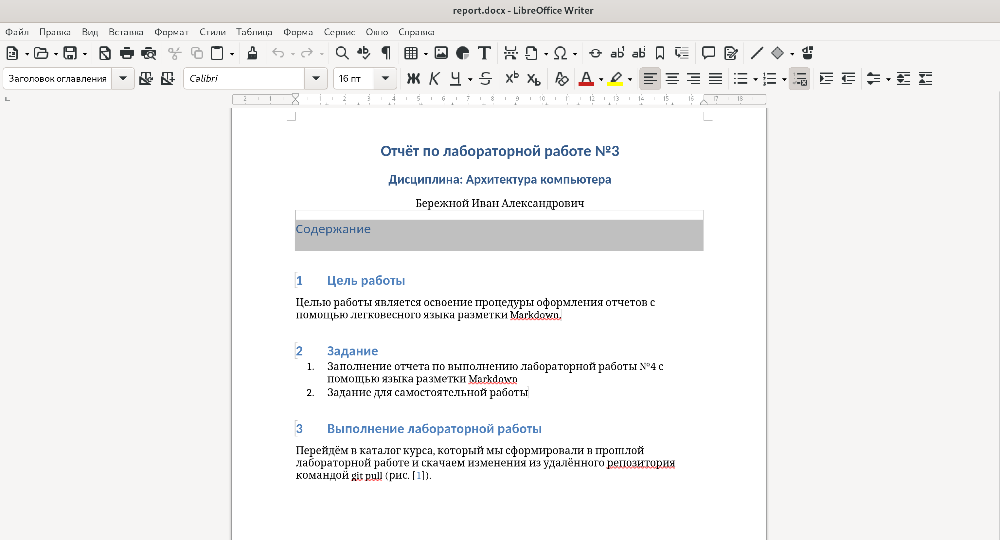

---
## Front matter
title: "Отчёт по лабораторной работе №3"
subtitle: "Дисциплина: Архитектура компьютера"
author: "Бережной Иван Александрович"

## Generic otions
lang: ru-RU
toc-title: "Содержание"

## Bibliography
bibliography: bib/cite.bib
csl: pandoc/csl/gost-r-7-0-5-2008-numeric.csl

## Pdf output format
toc: true # Table of contents
toc-depth: 2
lof: true # List of figures
lot: true # List of tables
fontsize: 13pt
linestretch: 1.5
papersize: a4
documentclass: scrreprt
## I18n polyglossia
polyglossia-lang:
  name: russian
  options:
	- spelling=modern
	- babelshorthands=true
polyglossia-otherlangs:
  name: english
## I18n babel
babel-lang: russian
babel-otherlangs: english
## Fonts
mainfont: PT Serif
romanfont: PT Serif
sansfont: PT Sans
monofont: PT Mono
mainfontoptions: Ligatures=TeX
romanfontoptions: Ligatures=TeX
sansfontoptions: Ligatures=TeX,Scale=MatchLowercase
monofontoptions: Scale=MatchLowercase,Scale=0.9
## Biblatex
biblatex: true
biblio-style: "gost-numeric"
biblatexoptions:
  - parentracker=true
  - backend=biber
  - hyperref=auto
  - language=auto
  - autolang=other*
  - citestyle=gost-numeric
## Pandoc-crossref LaTeX customization
figureTitle: "Рис."
tableTitle: "Таблица"
listingTitle: "Листинг"
lofTitle: "Список иллюстраций"
lotTitle: "Список таблиц"
lolTitle: "Листинги"
## Misc options
indent: true
header-includes:
  - \usepackage{indentfirst}
  - \usepackage{float} # keep figures where there are in the text
  - \floatplacement{figure}{H} # keep figures where there are in the text
---

# Цель работы

Целью работы является освоение процедуры оформления отчетов с помощью легковесного языка разметки Markdown.

# Задание

1. Заполнение отчета по выполнению лабораторной работы №4 с помощью языка разметки Markdown
2. Задание для самостоятельной работы

# Выполнение лабораторной работы

Перейдём в каталог курса, который мы сформировали в прошлой лабораторной работе и скачаем изменения из удалённого репозитория командой git pull (рис. @fig:001).

{ #fig:001 width=70% }

Теперь перейдём в каталог с шаблоном отчета по лабораторной работе № 3. Введём команду make, которая позволила провести компиляцию шаблона, используя Makefile (рис. @fig:002). В результате в папке lab3 мы можем увидеть сгенерированные файлы report.pdf и report.docx (рис. @fig:003).

{ #fig:002 width=70% }

{ #fig:003 width=70% }
 
Удалим полученные файлы командой make clean (рис. @fig:004). Проверим результат в файловом менеджере (рис. @fig:005). 

{ #fig:004 width=70% }

{ #fig:005 width=70% }

Заполним отчёт по данной лабораторной работе и скомпилируем его с использованием Makefile'а (рис. @fig:006).

{ #fig:006 width=70% }

Теперь проверим корректность полученных файлов report.docx (рис. @fig:007) и report.pdf (рис. @fig:008). 

{ #fig:007 width=70% }

{ #fig:008 width=70% }

Перейдём к папке курса и загрузим файлы на Github (рис. @fig:009). 

{ #fig:009 width=70% }

# Задание для самостоятельной работы

Перейдём к каталогу с отчётом по второй лабораторной работе и удалим нынешний отчёт (рис. @fig:010). 

{ #fig:010 width=70% }

Теперь создадим новый отчёт, используя язык разметки Markdown (рис. @fig:011).

{ #fig:011 width=70% }

Загрузим файлы отчёта лабораторной работы №2 на GitHub (рис. @fig:012).

{ #fig:012 width=70% }

# Выводы

В ходе данной лабораторной работы мы освоили процедуры оформления отчётов с помощью легковесного языка разметки Markdown.

# Список литературы{.unnumbered}

::: [Архитектура ЭВМ](https://esystem.rudn.ru/mod/resource/view.php?id=1030551)
