---
## Front matter
title: "Отчёт по лабораторной работе №4"
subtitle: "Дисциплина: Архитектура компьютера"
author: "Бережной Иван Александрович"

## Generic otions
lang: ru-RU
toc-title: "Содержание"

## Bibliography
bibliography: bib/cite.bib
csl: pandoc/csl/gost-r-7-0-5-2008-numeric.csl

## Pdf output format
toc: true # Table of contents
toc-depth: 2
lof: true # List of figures
lot: true # List of tables
fontsize: 13pt
linestretch: 1.5
papersize: a4
documentclass: scrreprt
## I18n polyglossia
polyglossia-lang:
  name: russian
  options:
	- spelling=modern
	- babelshorthands=true
polyglossia-otherlangs:
  name: english
## I18n babel
babel-lang: russian
babel-otherlangs: english
## Fonts
mainfont: PT Serif
romanfont: PT Serif
sansfont: PT Sans
monofont: PT Mono
mainfontoptions: Ligatures=TeX
romanfontoptions: Ligatures=TeX
sansfontoptions: Ligatures=TeX,Scale=MatchLowercase
monofontoptions: Scale=MatchLowercase,Scale=0.9
## Biblatex
biblatex: true
biblio-style: "gost-numeric"
biblatexoptions:
  - parentracker=true
  - backend=biber
  - hyperref=auto
  - language=auto
  - autolang=other*
  - citestyle=gost-numeric
## Pandoc-crossref LaTeX customization
figureTitle: "Рис."
tableTitle: "Таблица"
listingTitle: "Листинг"
lofTitle: "Список иллюстраций"
lolTitle: "Листинги"
## Misc options
indent: true
header-includes:
  - \usepackage{indentfirst}
  - \usepackage{float} # keep figures where there are in the text
  - \floatplacement{figure}{H} # keep figures where there are in the text
---

# Цель работы

Освоение процедуры компиляции и сборки программ, написанных на ассемблере NASM.

# Задание

1. Написание программы Hello world!
2. Работа с транслятором NASM
3. Работа с компоновщиком LD
4. Запуск исполняемого файла
5. Задание для самостоятельной работы

# Выполнение лабораторной работы

## Написание программы Hello world!
Создадим каталог для работы с программами на языке ассемблера NASM командой mkdir. Перейдём в него (утилита cd) и создадим текстовый файл hello.asm с помощью команды touch (рис. @fig:001).

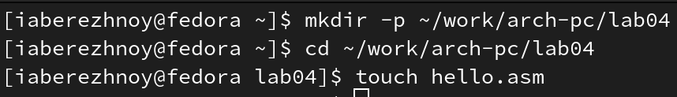{ #fig:001 width=70% }

Откроем новый файл в текстовом редакторе и введём в него предложенный текст (рис. @fig:002).

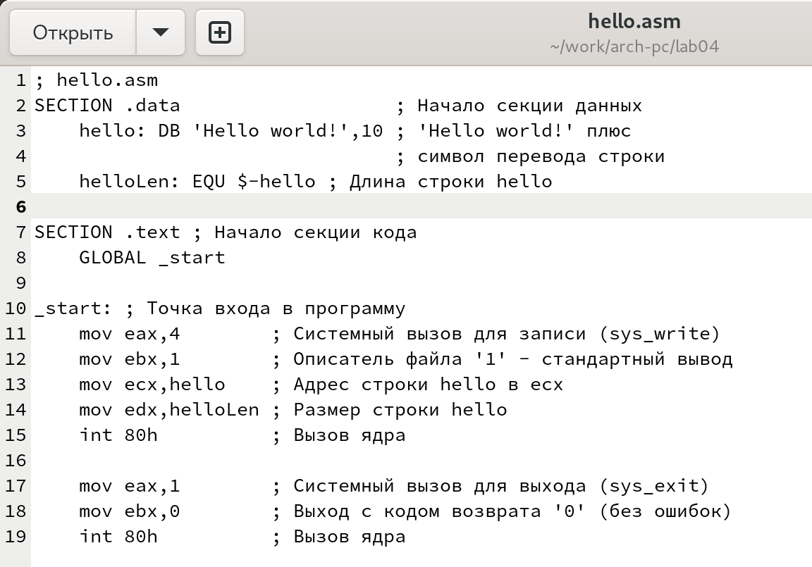{ #fig:002 width=70% }

## Работа с транслятором NASM
Напишем следующую команду в терминале: nasm -f elf hello.asm и выведем список файлов в репозитории командой ls. Видим новый файл: hello.o. Расширение .o указывает на то, что файл является объектным (рис. @fig:003).

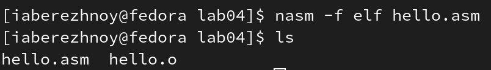{ #fig:003 width=70% }

Теперь выполним команду nasm -o obj.o elf -g -l list.lst hello.asm. Создались файлы obj.o и list.lst (рис. @fig:004).

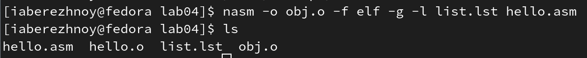{ #fig:004 width=70% }

## Работа с компоновщиком LD
Передадим объектный файл на обработку компоновщику командой ld. В репозитории появился исполняемый файл hello.exe (рис. @fig:005).

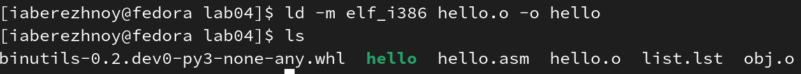{ #fig:005 width=70% }

Введём следующую команду (рис. @fig:006). В папке появился ещё один исполняемый файл, но с другим именем, а именно main.exe. Объектный файл, из которого был собран исполняемый, называется obj.o (имена различаются, т.к. мы указали значение main после флага -o).

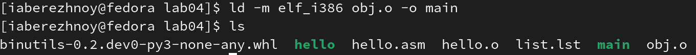{ #fig:006 width=70% }

## Запуск исполняемого файла
Запустим файл командой ./hello (рис. @fig:007).

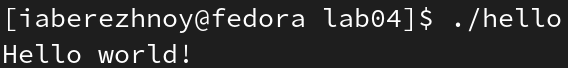{ #fig:007 width=70% }

## Задание для самостоятельной работы
С помощью команды cp создадим копию файла hello.asm с именем lab4.asm (рис. @fig:008).

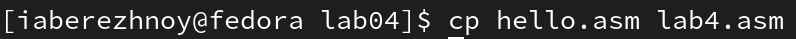{ #fig:008 width=70% }

Откроем новый файл в текстовом редакторе и заменим в 3-ей строчке текст "Hello world!" на "Ivan Berezhnoy". Сохраним изменения (рис. @fig:009).

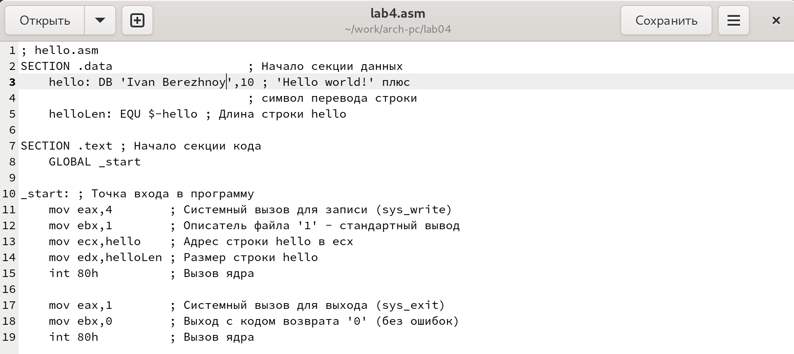{ #fig:009 width=70% }

Создадим объектный файл, оттранслировав текст программы lab4.asm - получили объектный файл lab4.o (рис. @fig:010). Командой ld скомпануем последний файл - получили исполняемый файл lab4.exe (рис. @fig:011). Теперь исполним его с помощью команды ./lab4. В консоль вывелся наш текст "Ivan Berezhnoy" (рис. @fig:012).

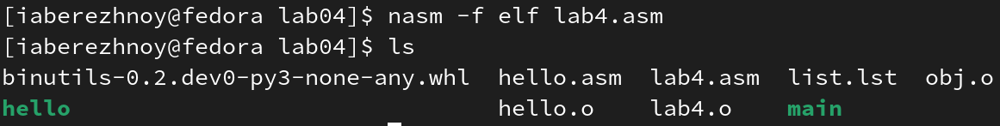{ #fig:010 width=70% }

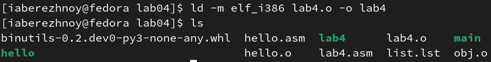{ #fig:011 width=70% }

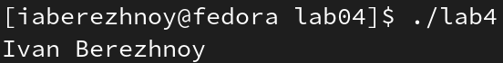{ #fig:012 width=70% }

Скопируем файлы hello.asm и lab4.asm в репозиторий с лабораторной работой №4 (рис. @fig:013).

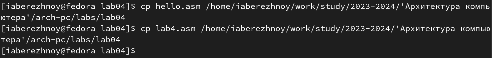{ #fig:013 width=70% }

Теперь загрузим файлы на GitHub (рис. @fig:014).

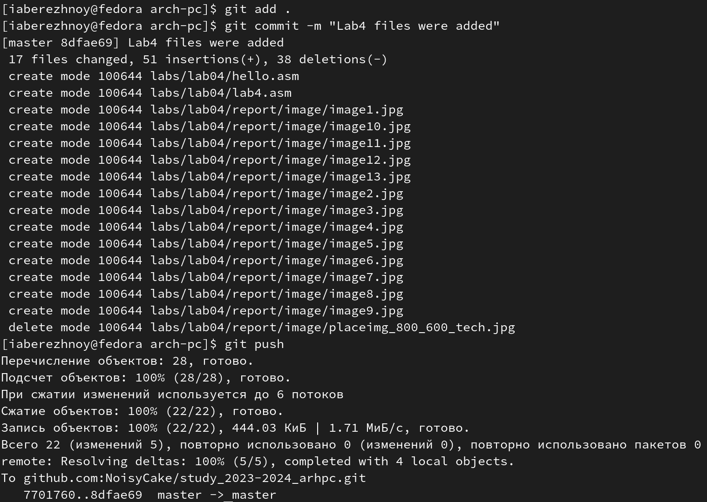{ #fig:014 width=70% }

# Выводы

В ходе лабораторной работы мы написали простейшие программы на ассемблере NASM, поработали с транслятором NASM и компановщикоом LD и изучили расширенный синтаксис командной строки NASM. 

# Список литературы{.unnumbered}

::: [Архитектура ЭВМ](https://esystem.rudn.ru/mod/resource/view.php?id=1030552)
