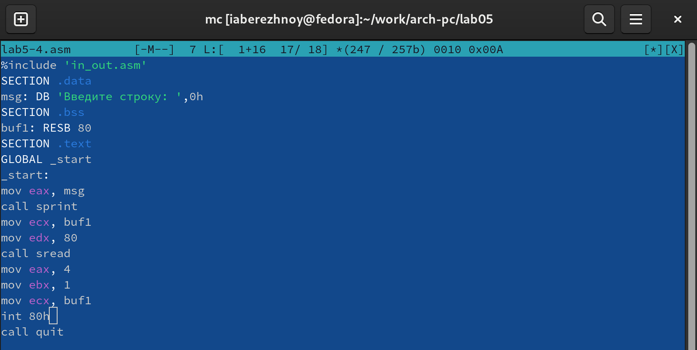

---
## Front matter
title: "Отчёт по лабораторной работе №5"
subtitle: "Дисциплина: Архитектура компьютера"
author: "Бережной Иван Александрович"

## Generic otions
lang: ru-RU
toc-title: "Содержание"

## Bibliography
bibliography: bib/cite.bib
csl: pandoc/csl/gost-r-7-0-5-2008-numeric.csl

## Pdf output format
toc: true # Table of contents
toc-depth: 2
lof: true # List of figures
lot: true # List of tables
fontsize: 13pt
linestretch: 1.5
papersize: a4
documentclass: scrreprt
## I18n polyglossia
polyglossia-lang:
  name: russian
  options:
	- spelling=modern
	- babelshorthands=true
polyglossia-otherlangs:
  name: english
## I18n babel
babel-lang: russian
babel-otherlangs: english
## Fonts
mainfont: PT Serif
romanfont: PT Serif
sansfont: PT Sans
monofont: PT Mono
mainfontoptions: Ligatures=TeX
romanfontoptions: Ligatures=TeX
sansfontoptions: Ligatures=TeX,Scale=MatchLowercase
monofontoptions: Scale=MatchLowercase,Scale=0.9
## Biblatex
biblatex: true
biblio-style: "gost-numeric"
biblatexoptions:
  - parentracker=true
  - backend=biber
  - hyperref=auto
  - language=auto
  - autolang=other*
  - citestyle=gost-numeric
## Pandoc-crossref LaTeX customization
figureTitle: "Рис."
listingTitle: "Листинг"
lofTitle: "Список иллюстраций"
lolTitle: "Листинги"
## Misc options
indent: true
header-includes:
  - \usepackage{indentfirst}
  - \usepackage{float} # keep figures where there are in the text
  - \floatplacement{figure}{H} # keep figures where there are in the text
---

# Цель работы

Приобретение практических навыков работы в Midnight Commander. Освоение инструкций
языка ассемблера mov и int.

# Задание

1. Основы работы с mc
2. Работа с языком ассемблера NASM
3. Подключение внешнего файла
4. Задание для самостоятельной работы

# Выполнение лабораторной работы

## Основы работы с mc
Откроем Midnight Commander командой mc и перейдём в каталог ~/work/arch-pc, который мы создали в ходе выполнения лабораторной работы №4 (рис. @fig:001).

{ #fig:001 width=70% }

Создадим папку lab05, в которой и будем работать в дальнейшем (рис. @fig:002). Перейдём в неё.

{ #fig:002 width=70% }

С помощью команды touch создаём файл lab5-1.asm (рис. @fig:003).

## Работа с языком ассемблера NASM
{ #fig:003 width=70% }

Откроем lab5-1.asm, используя функциональную клавишу F4. Мы попали в редактор mcedit. Введём текст программы из предложенного листинга и сохраним изменения (рис. @fig:004).

{ #fig:004 width=70% }

Откроем файл для просмотра и убедимся, что все изменения сохранились корректно (рис. @fig:005).

{ #fig:005 width=70% }

Оттранслируем текст программы в объектный файл, затем выполним его компоновку (рис. @fig:006) и запустим новый исполняемый файл. Подаём на ввод строку "Бережной Иван Александрович" (рис. @fig:007).

{ #fig:006 width=70% }

{ #fig:007 width=70% }

## Подключение внешнего файла
Скачаем файл in_out.asm и переместим его в каталог, в котором мы сейчас работаем. Для этого скопируем его из загрузок в ~/work/arch-pc/lab05 (рис. @fig:008).

{ #fig:008 width=70% }

Создадим копию файла lab5-1.asm, назвав lab5-2.asm. Используя предложенный листинг, изменим текст программы в созданном файле с использованием подпрограмм из внешнего файла in_out.asm (рис. @fig:009).

{ #fig:009 width=70% }

Проверим работу файла. Для этого оттранслируем объектный файл, выполним его компоновку и запустим исполняемый файл. Видим запрос на ввод строки. Введём "Бережной Иван Александрович" (рис. @fig:010).

{ #fig:010 width=70% }

Немного изменим файл lab5-2.asm, заменив sprintLF на sprint. Снова создадим исполняемый файл по той же схеме и запустим его. Видим, что запрос на ввод строки находится на той же строке, что и приглашение типа "Введите строку:" (рис. @fig:011). В предыдущей версии программы запрос на ввод был на следующей строке после приглашения.

{ #fig:011 width=70% }

## Задание для самостоятельной работы
Создадим копию файла lab5-1.asm, назвав lab5-3.asm (рис. @fig:012). Редактируем файл так, чтобы программа выводила вводимую пользователем строку (так же изменим приглашение на "Введите свою фамилию:") (рис. @fig:013).

{ #fig:012 width=70% }

{ #fig:013 width=70% }

Теперь создадим исполняемый файл по знакомой нам схеме и запустим его (рис. @fig:014). Всё работает корректно.

{ #fig:014 width=70% }

**Листинг 5.1**

```nasm
SECTION .data
msg: DB 'Введите свою фамилию:',10
msgLen: EQU $-msg
SECTION .bss
buf1: RESB 80
SECTION .text
GLOBAL _start
_start:
mov eax,4
mov ebx,1
mov ecx,msg
mov edx,msgLen
int 80h
mov eax, 3
mov ebx, 0
mov ecx, buf1
mov edx, 80
int 80h
mov eax, 4
mov ebx, 1
mov ecx, buf1
mov edx, buf1
int 80h
mov eax,1
mov ebx,0
int 80h
```

Создадим копию файла lab5-2.asm, назвав lab5-4.asm (рис. @fig:015). Редактируем файл так, чтобы он выполнял те же функции, что и lab5-3.asm (рис. @fig:016).

{ #fig:015 width=70% }

{ #fig:016 width=70% }

Теперь создадим исполняемый файл по знакомой нам схеме и запустим его (рис. @fig:017). Всё работает корректно.

{ #fig:017 width=70% }

**Листинг 5.2**

```nasm
%include 'in_out.asm'
SECTION .data
msg: DB 'Введите строку: ',0h
SECTION .bss
buf1: RESB 80
SECTION .text
GLOBAL _start
_start:
mov eax, msg
call sprint
mov ecx, buf1
mov edx, 80
call sread
mov eax, 4
mov ebx, 1
mov ecx, buf1
int 80h
call quit
```

# Вывод
В ходе выполнения лабораторной работы мы приобрели практические навыки работы в Midnight Commander и освоили инструкции языка ассемблера mov и int.

# Список литературы{.unnumbered}

::: [Архитектура ЭВМ](https://esystem.rudn.ru/mod/resource/view.php?id=1030553)
