---
## Front matter
title: "Отчёт по лабораторной работе №6"
subtitle: "Дисциплина: Архитектура компьютера"
author: "Бережной Иван Александрович"

## Generic otions
lang: ru-RU
toc-title: "Содержание"

## Bibliography
bibliography: bib/cite.bib
csl: pandoc/csl/gost-r-7-0-5-2008-numeric.csl

## Pdf output format
toc: true # Table of contents
toc-depth: 2
lof: true # List of figures
lot: true # List of tables
fontsize: 12pt
linestretch: 1.5
papersize: a4
documentclass: scrreprt
## I18n polyglossia
polyglossia-lang:
  name: russian
  options:
	- spelling=modern
	- babelshorthands=true
polyglossia-otherlangs:
  name: english
## I18n babel
babel-lang: russian
babel-otherlangs: english
## Fonts
mainfont: PT Serif
romanfont: PT Serif
sansfont: PT Sans
monofont: PT Mono
mainfontoptions: Ligatures=TeX
romanfontoptions: Ligatures=TeX
sansfontoptions: Ligatures=TeX,Scale=MatchLowercase
monofontoptions: Scale=MatchLowercase,Scale=0.9
## Biblatex
biblatex: true
biblio-style: "gost-numeric"
biblatexoptions:
  - parentracker=true
  - backend=biber
  - hyperref=auto
  - language=auto
  - autolang=other*
  - citestyle=gost-numeric
## Pandoc-crossref LaTeX customization
figureTitle: "Рис."
tableTitle: "Таблица"
listingTitle: "Листинг"
lofTitle: "Список иллюстраций"
lolTitle: "Листинги"
## Misc options
indent: true
header-includes:
  - \usepackage{indentfirst}
  - \usepackage{float} # keep figures where there are in the text
  - \floatplacement{figure}{H} # keep figures where there are in the text
---

# Цель работы

Освоить арифметические инструкций языка ассемблера NASM.

# Задание

1. Разбор символьных и численных данных в NASM
2. Выполнение арифметических операций в NASM
3. Ответы на вопросы
4. Задание для самостоятельной работы

# Выполнение лабораторной работы

## Разбор символьных и численных данных в NASM
Для начала создадим каталог lab06 для последующей работы. Для этогого воспользуемся командой mkdir. Перейдём в него и создадим файл lab6-1.asm (рис. @fig:001).

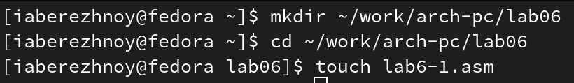{ #fig:001 width=70% }

Скопируем предложенный листинг в новый файл (рис. @fig:002). Создадим и запустим исполняемый файл (рис. @fig:003). В выводе видим букву "j".

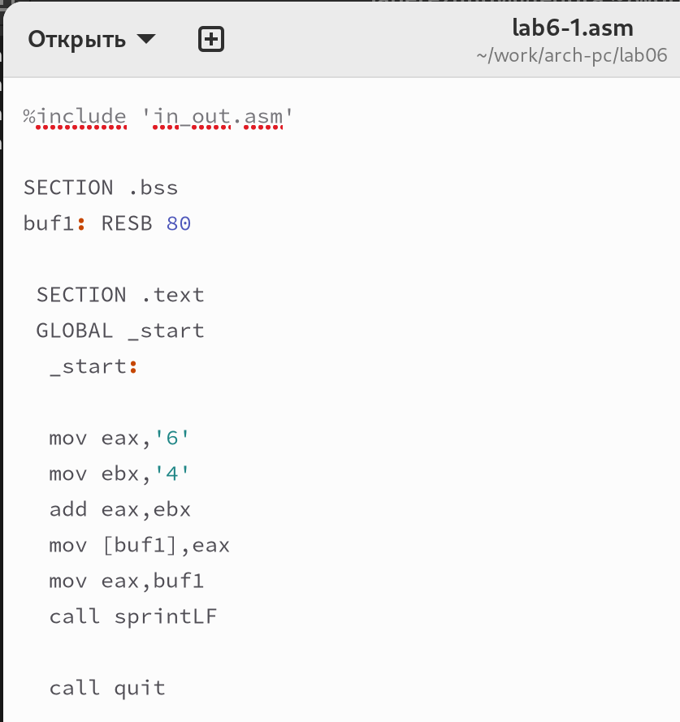{ #fig:002 width=70% }

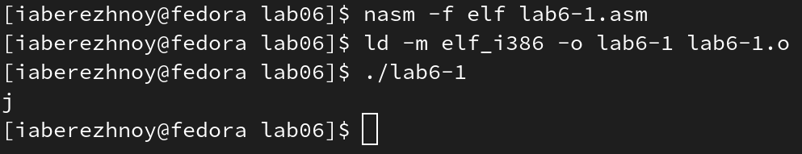{ #fig:003 width=70% }

Немного изменим текст программы, убрав одинарные кавычки в строках `mov eax,'6'` и `mov ebx,'4'` (рис. @fig:004). Также пересоздадим и запустим исполняемый файл - получили перевод строки (рис. @fig:005). 

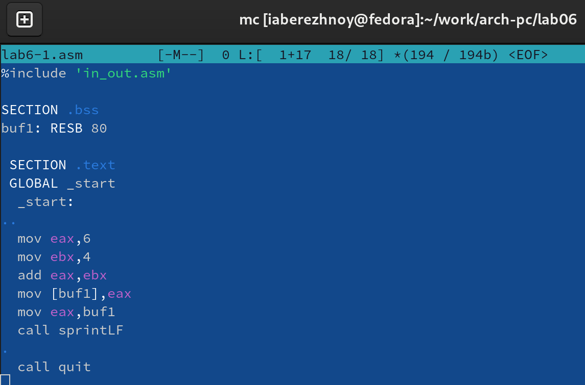{ #fig:004 width=70% }

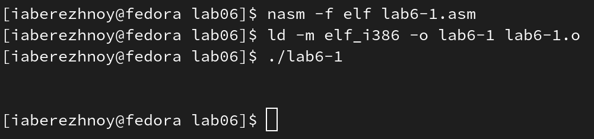{ #fig:005 width=70% }

Создадим файл lab6-2.asm и скопируем в него второй листинг (рис. @fig:006). Для него тоже создадим исполняемый файл и запустим его. В выводе получили 106 (рис. @fig:007).

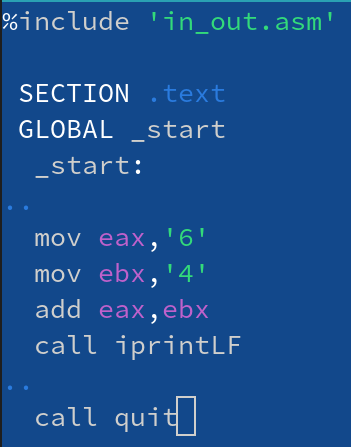{ #fig:006 width=70% }

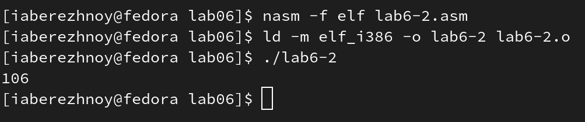{ #fig:007 width=70% }

Аналогично предыдущей программе изменим в этой пару строк (рис. @fig:008) и запустим уже изменённый файл. В результате получили 10 (рис. @fig:009).

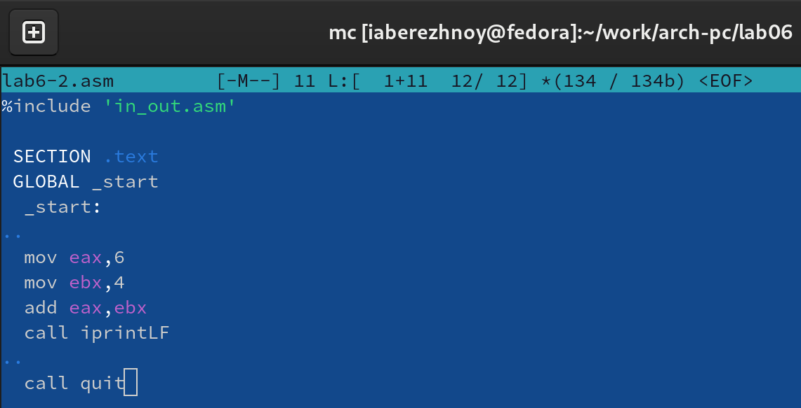{ #fig:008 width=70% }

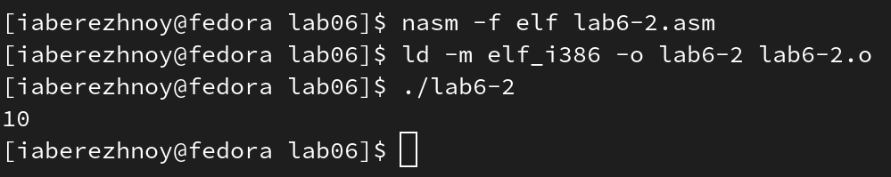{ #fig:009 width=70% }

Теперь заменим всё в этом же файле функцию iprintLF на iprint. Создадим исполняемый файл и запустим его. Получили всё тот же результат, но теперь отсутствует перевод строки (рис. @fig:010).

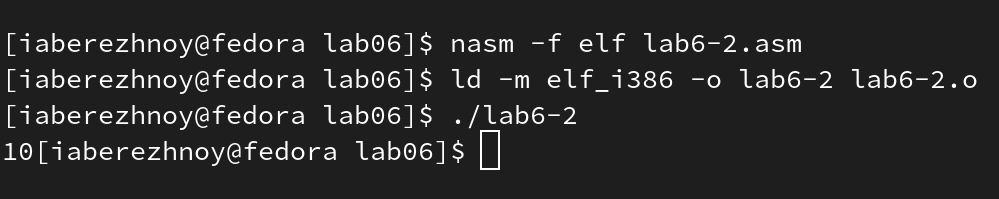{ #fig:010 width=70% }

## Выполнение арифметических операций в NASM
Создадим файл lab6-3.asm и скопируем в него третий код (рис. @fig:011). Создадим и запустим исполняемый файл - в результате получили 4, а остаток от деления 1 (рис. @fig:012).

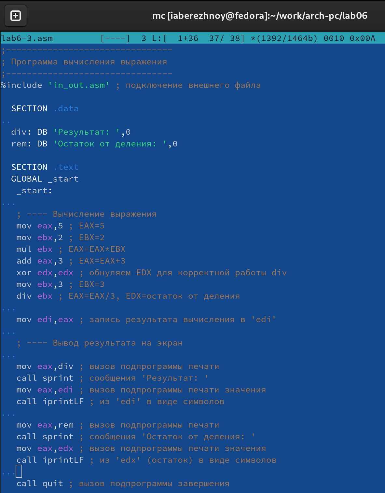{ #fig:011 width=70% }

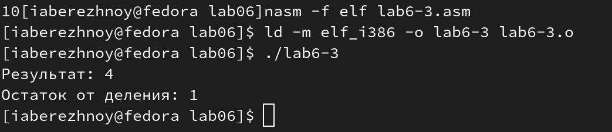{ #fig:012 width=70% }

Изменим текст программы так, чтобы вычислялось значение выражения (4*6+2)/5. Проверим работу файла (рис. @fig:013).

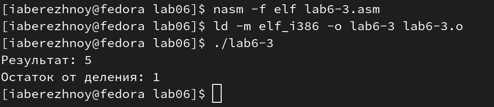{ #fig:013 width=70% }

Создадим файл variant.asm командой touch, скопируем в него листинг №4 (рис. @fig:014) и проверим работы исполняемого файла. Для этого введём 1132236041 - получили 2 (рис. @fig:015), а значит, в задании для самостоятельной работы мы будем выполнять вариант под номером 2.

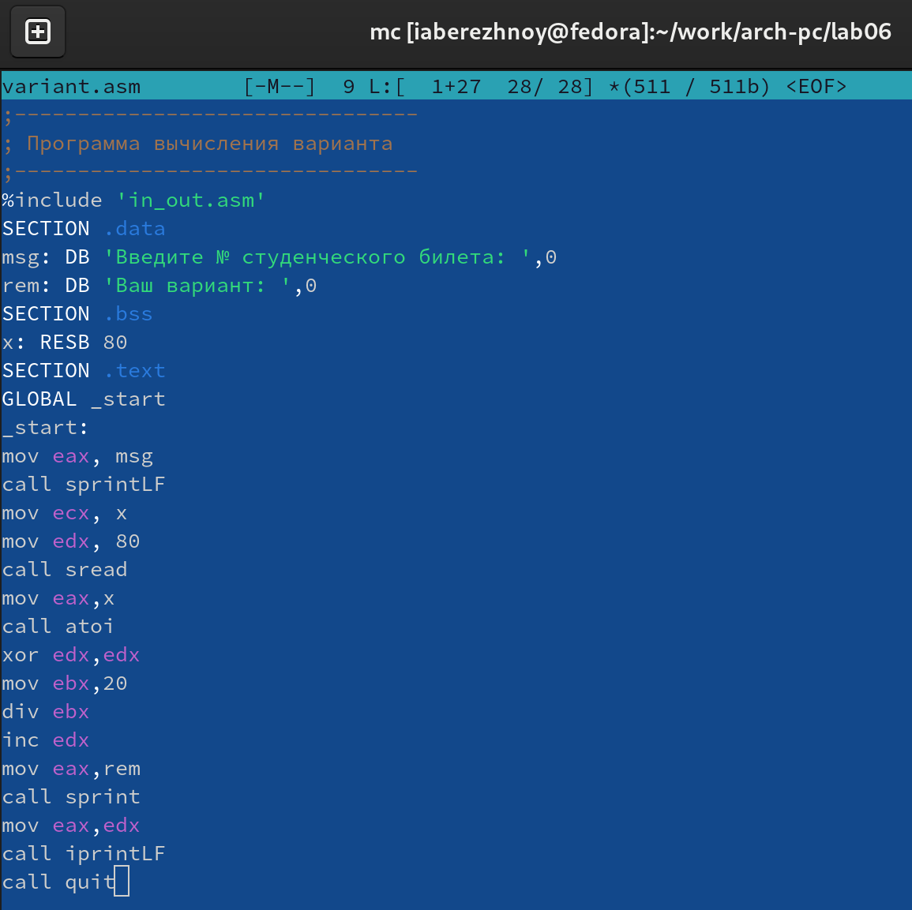{ #fig:014 width=70% }

{ #fig:015 width=70% }

## Ответы на вопросы
1. За вывод на экран сообщения "Ваш вариант:" отвечают строки
```nasm
mov eax,rem
call sprint
```
2. Первая инструкция используется, чтобы скопировать адрес вводимой строки в регистр ecx;
Вторая инструкция используется, чтобы установить в регистр edx длинну вводимой строки;
Третья инструкция используется, чтобы вызвать подпрограмму из внешнего файла, обеспечивающей ввод текста с клавиатуры.
3. Инструкция call atoi используется, чтобы преобразовать ascii-код символа в целое число.
4. За вычисление варианта в листинге 6.4 отвечают следующие строки:
```nasm
xor edx,edx
mov ebx,20
div ebx
inc edx
```
5. Остаток от деления при выполнении инструкции div ebx записывается в регистр edx.
6. Инструкция inc edx используется для увеличения значения в регистре edx на 1.
7. За вывод результата вычислений на экран в листинге 6.4 отвечают следующие строки:
```nasm
mov eax,edx
call iprintLF
```

## Задание для самостоятельной работы
Напишем программу для вычисления выражения y = (12x + 3)5 в файле lab6-4.asm (листинг 6.1). Проверим её работоспособность (рис. @fig:016)

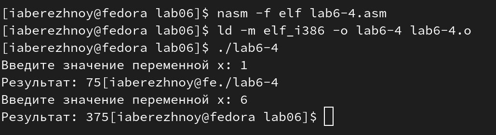{ #fig:016 width=70% }

**Листинг 6.1. Программа вычисления выражения y = (12x + 3)5**
```nasm
%include 'in_out.asm'

SECTION .data
msg: DB 'Введите значение переменной x: ',0
rem: DB 'Результат: ',0

SECTION .bss
x: RESB 80

SECTION .text
GLOBAL _start

_start:
    ; ---- Ввод значения переменной x
    mov eax, msg
    call sprint
    mov ecx, x
    mov edx, 80
    call sread

    ; ---- Вычисление выражения (12𝑥 + 3)5
    mov eax, x
    call atoi
    mov ebx, 12
    imul eax, ebx
    add eax, 3
    imul eax, 5
    mov edi, eax

    ; ---- Вывод результата на экран
    mov eax, rem
    call sprint
    mov eax, edi
    call iprint
    call quit
```

# Выводы

В ходе выполнения лабораторной работы мы разобрали символьные и численные данные в NASM, а также освоили арифметические операции языка ассемблера NASM.

# Список литературы{.unnumbered}

::: [Архитектура ЭВМ](https://esystem.rudn.ru/mod/resource/view.php?id=1030554)
