---
## Front matter
title: "Отчёт по лабораторной работе №7"
subtitle: "Дисциплина: Архитектура компьютера"
author: "Бережной Иван Александрович"

## Generic otions
lang: ru-RU
toc-title: "Содержание"

## Bibliography
bibliography: bib/cite.bib
csl: pandoc/csl/gost-r-7-0-5-2008-numeric.csl

## Pdf output format
toc: true # Table of contents
toc-depth: 2
lof: true # List of figures
lot: true # List of tables
fontsize: 13pt
linestretch: 1.5
papersize: a4
documentclass: scrreprt
## I18n polyglossia
polyglossia-lang:
  name: russian
  options:
	- spelling=modern
	- babelshorthands=true
polyglossia-otherlangs:
  name: english
## I18n babel
babel-lang: russian
babel-otherlangs: english
## Fonts
mainfont: PT Serif
romanfont: PT Serif
sansfont: PT Sans
monofont: PT Mono
mainfontoptions: Ligatures=TeX
romanfontoptions: Ligatures=TeX
sansfontoptions: Ligatures=TeX,Scale=MatchLowercase
monofontoptions: Scale=MatchLowercase,Scale=0.9
## Biblatex
biblatex: true
biblio-style: "gost-numeric"
biblatexoptions:
  - parentracker=true
  - backend=biber
  - hyperref=auto
  - language=auto
  - autolang=other*
  - citestyle=gost-numeric
## Pandoc-crossref LaTeX customization
figureTitle: "Рис."
tableTitle: "Таблица"
listingTitle: "Листинг"
lofTitle: "Список иллюстраций"
lolTitle: "Листинги"
## Misc options
indent: true
header-includes:
  - \usepackage{indentfirst}
  - \usepackage{float} # keep figures where there are in the text
  - \floatplacement{figure}{H} # keep figures where there are in the text
---

# Цель работы

Изучение команд условного и безусловного переходов. Приобретение навыков написания
программ с использованием переходов. Знакомство с назначением и структурой файла
листинга.

# Задание

1. Разбор основ по переходам в NASM
2. Изучение структуры файла листинга
3. Задание для самостоятельной работы

# Выполнение лабораторной работы

## Разбор основ по переходам в NASM
Создадим каталог для дальнейшей работы, а также файл в нём lab7-1.asm (рис. @fig:001). Скопируем в новый файл код из предложенного листинга (рис. @fig:002), затем создадим и запустим исполняемый файл (рис. @fig:003).

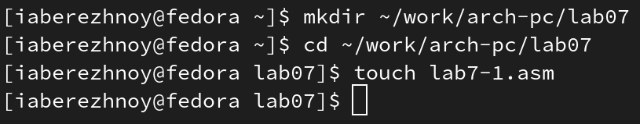{ #fig:001 width=70% }

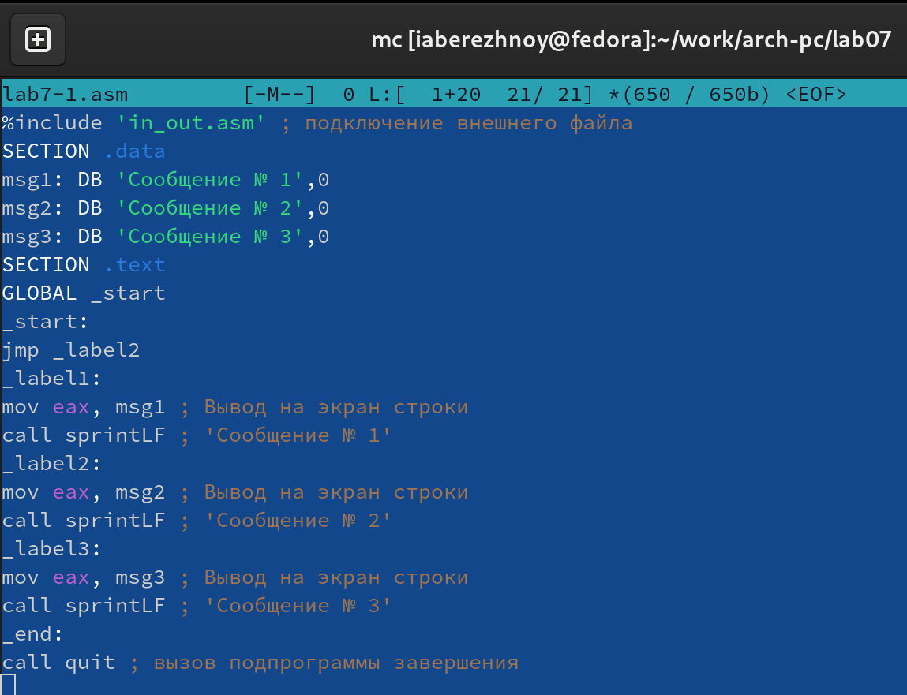{ #fig:002 width=70% }

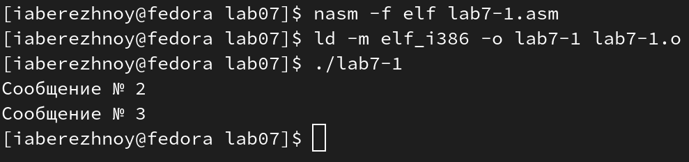{ #fig:003 width=70% }

Немного изменим программу, добавив инструкцию jmp_label1 после вывода сообщения №2 (рис. @fig:004). Повторно создадим и запустим исполняемый файл рис. @fig:005).

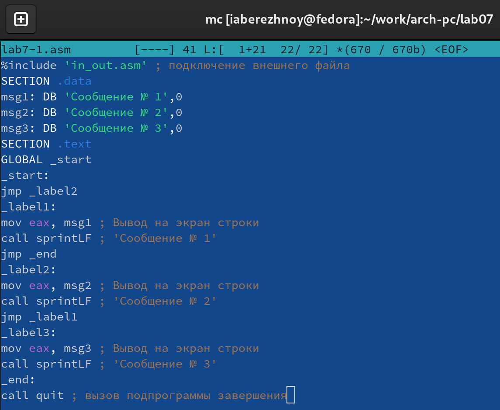{ #fig:004 width=70% }

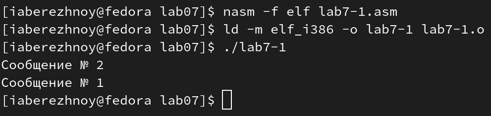{ #fig:005 width=70% }

Снова изменим файл, добавив инструкцию jmp_label2 после вывода сообщения №3 (рис. @fig:006). Теперь при запуске программы видим вывод сообщений в обратном порядке (рис. @fig:007).

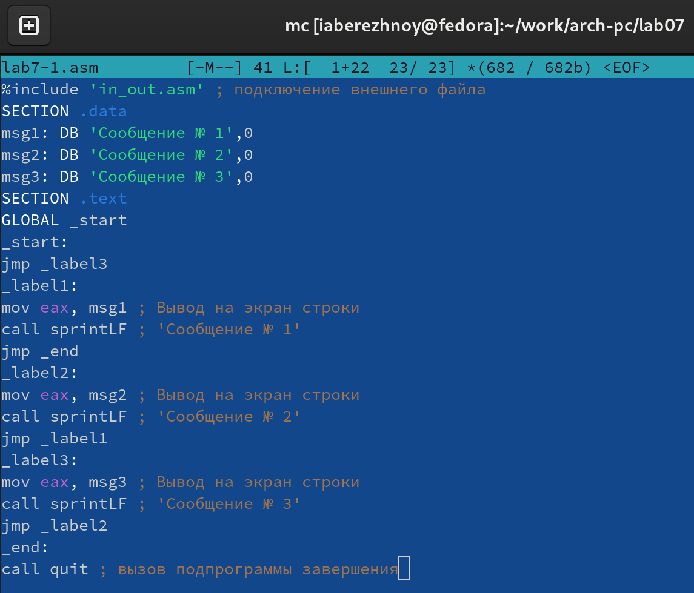{ #fig:006 width=70% }

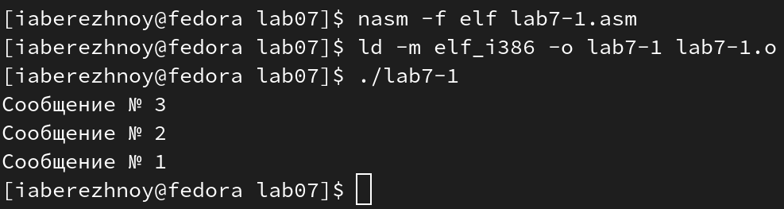{ #fig:007 width=70% }

Создадим файл lab7-2.asm и скопируем в него предложенный листинг (рис. @fig:008). Создадим исполняемый файл и проверим его работу для разных значений B (рис. @fig:009).

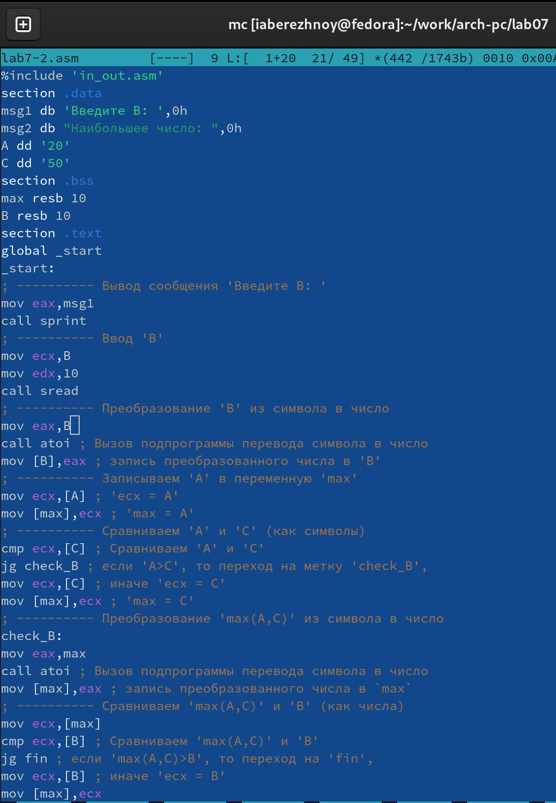{ #fig:008 width=70% }

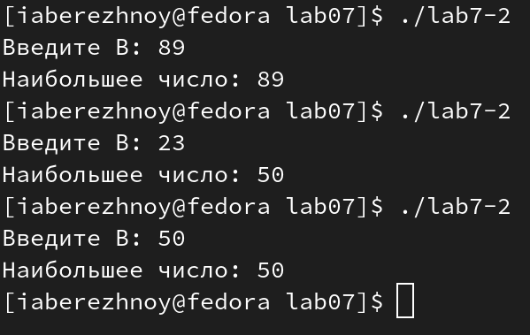{ #fig:009 width=70% }

## Изучение структуры файла листинга
Создадим файл листинга для программы из файла lab7-2.asm командой `nasm -f elf -l lab7-2.lst lab7-2.asm` и откроем его (рис. @fig:010). Разберём несколько строк из этого файла:  
1. Строка 11: `jmp nextchar` позволяет безусловно перейти к метке nextchar;  
2. Строка 29: `mov edx, eax` содержит инструкцию mov, а значит значение в регистре eax копируется в регистр edx;  
3. Строка 30: `pop eax` перемещает последнее значение в стеке в регистр eax.

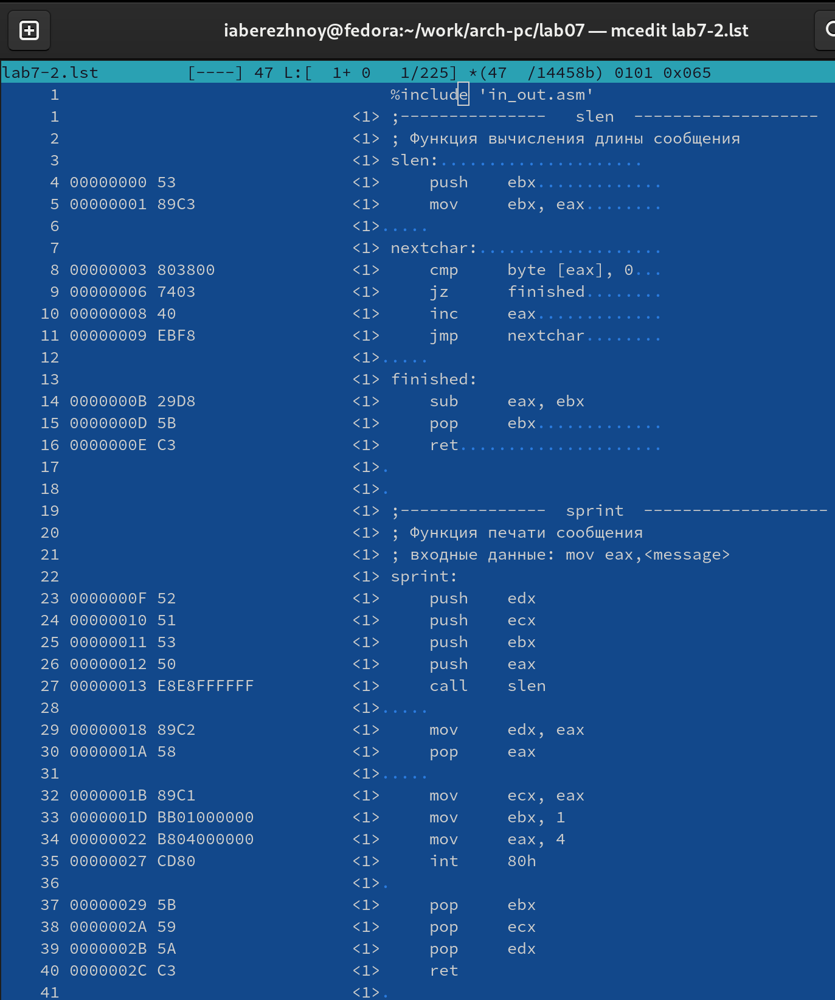{ #fig:010 width=70% }

Теперь откроем файл с программой lab7-2.asm и в блоке "Сравниваем 'max(A,C)' и 'B' (как числа)" удалим второй операнд в строке cmp ecx,[B] (рис. @fig:011). Выполним трансляцию с получением файла листинга и посмотрим, что в нём добавилось (рис. @fig:012). Видим, что в строке 39 появилась запись ошибки, которая как раз и указывает на то, что мы ввели некорректное число операндов к инструкции.

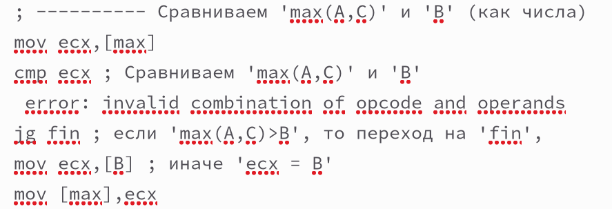{ #fig:011 width=70% }

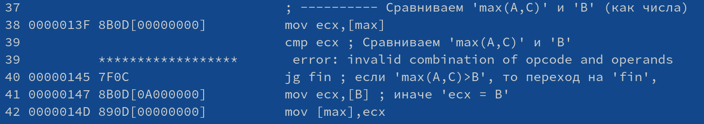{ #fig:012 width=70% }

## Задание для самостоятельной работы
Создадим файл lab7-3.asm и напишем в нём программу нахождения наименьшей из 3 целочисленных переменных a,b и c в соответствии с вариантом №2, полученным в предыдущей лабораторной работе (рис. @fig:013). Создадим исполняемый файл и проверим его работу (рис. @fig:014). Программа работает корректно.

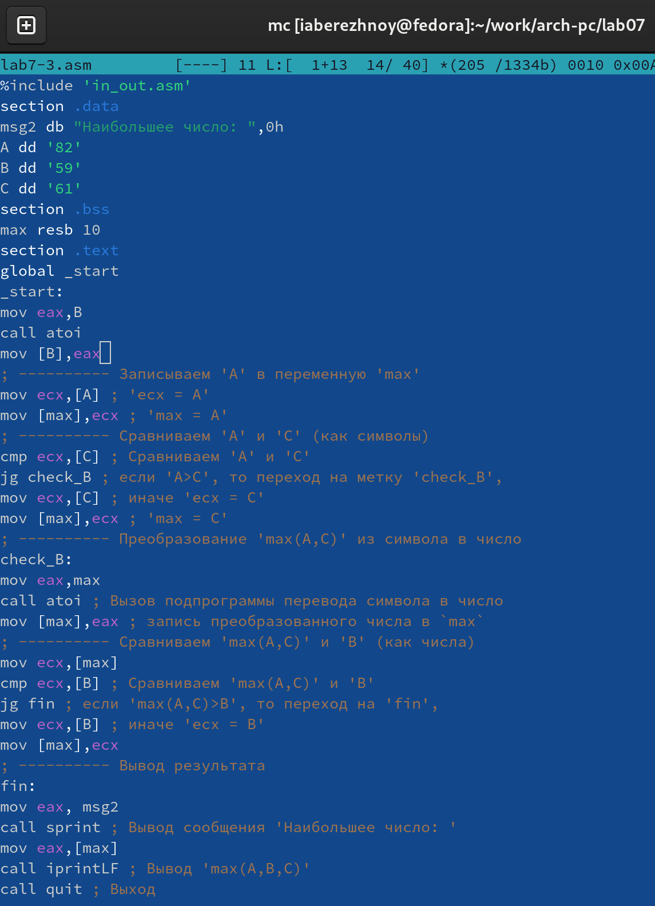{ #fig:013 width=70% }

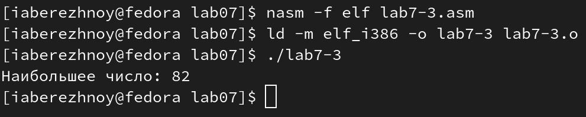{ #fig:014 width=70% }

**Листинг 7.1. Программа нахождения наибольшей из 3-ёх переменных**
```nasm
%include 'in_out.asm'
section .data
msg2 db "Наибольшее число: ",0h
A dd '82'
B dd '59'
C dd '61'
section .bss
max resb 10
section .text
global _start
_start:
mov eax,B
call atoi
mov [B],eax
; ---------- Записываем 'A' в переменную 'max'
mov ecx,[A] ; 'ecx = A'
mov [max],ecx ; 'max = A'
; ---------- Сравниваем 'A' и 'С' (как символы)
cmp ecx,[C] ; Сравниваем 'A' и 'С'
jg check_B ; если 'A>C', то переход на метку 'check_B',
mov ecx,[C] ; иначе 'ecx = C'
mov [max],ecx ; 'max = C'
; ---------- Преобразование 'max(A,C)' из символа в число
check_B:
mov eax,max
call atoi ; Вызов подпрограммы перевода символа в число
mov [max],eax ; запись преобразованного числа в `max`
; ---------- Сравниваем 'max(A,C)' и 'B' (как числа)
mov ecx,[max]
cmp ecx,[B] ; Сравниваем 'max(A,C)' и 'B'
jg fin ; если 'max(A,C)>B', то переход на 'fin',
mov ecx,[B] ; иначе 'ecx = B'
mov [max],ecx
; ---------- Вывод результата
fin:
```

Создадим файл lab7-4.asm и напишем в нём программу, которая для введённых с клавиатуры значений x и a вычисляет значение заданной функции варианта 2 (рис. @fig:015). Создадим исполняемый файл и проверим его работу (рис. @fig:016). Программа работает корректно.

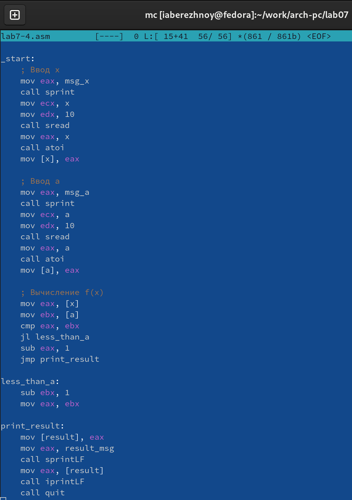{ #fig:015 width=70% }

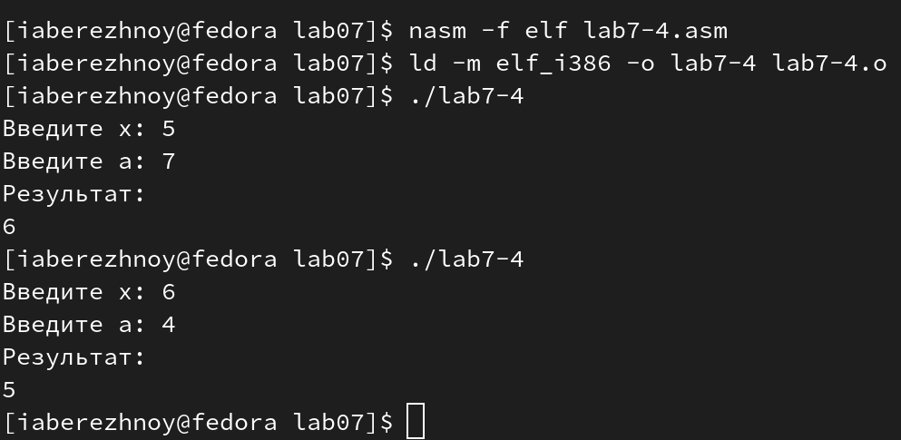{ #fig:016 width=70% }

**Листинг 7.2. Программа вычисления значения заданной функции**
```nasm
%include 'in_out.asm'

section .data
    msg_x db 'Введите x: ', 0
    msg_a db 'Введите a: ', 0
    result_msg db 'Результат: ', 0

section .bss
    x resb 10
    a resb 10
    result resb 10

section .text
global _start

_start:
    ; Ввод x
    mov eax, msg_x
    call sprint
    mov ecx, x
    mov edx, 10
    call sread
    mov eax, x
    call atoi
    mov [x], eax

    ; Ввод a
    mov eax, msg_a
    call sprint
    mov ecx, a
    mov edx, 10
    call sread
    mov eax, a
    call atoi
    mov [a], eax

    ; Вычисление f(x)
    mov eax, [x]
    mov ebx, [a]
    cmp eax, ebx
    jl less_than_a
    sub eax, 1
    jmp print_result

less_than_a:
    sub ebx, 1
    mov eax, ebx

print_result:
    mov [result], eax
    mov eax, result_msg
    call sprintLF
    mov eax, [result]
    call iprintLF
    call quit
```

# Выводы

В ходе лабораторной работы мы изучили команды условного и безусловного переходов, приобрели навыки написания программ с использованием переходов, ознакомились с назначением и структурой файла листинга.

# Список литературы{.unnumbered}

::: [Архитектура ЭВМ](https://esystem.rudn.ru/mod/resource/view.php?id=1030555)
