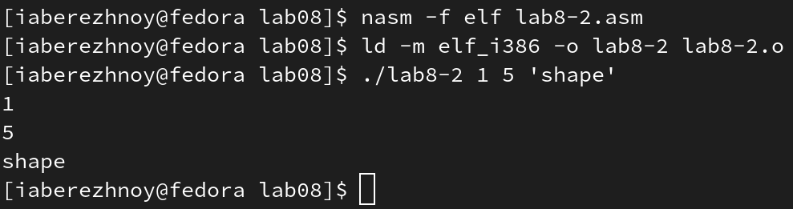
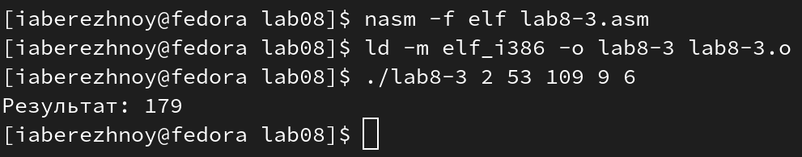

---
## Front matter
title: "Отчёт по лабораторной работе №8"
subtitle: "Дисциплина: Архитектура компьютера"
author: "Бережной Иван Александрович"

## Generic otions
lang: ru-RU
toc-title: "Содержание"

## Bibliography
bibliography: bib/cite.bib
csl: pandoc/csl/gost-r-7-0-5-2008-numeric.csl

## Pdf output format
toc: true # Table of contents
toc-depth: 2
lof: true # List of figures
lot: true # List of tables
fontsize: 13pt
linestretch: 1.5
papersize: a4
documentclass: scrreprt
## I18n polyglossia
polyglossia-lang:
  name: russian
  options:
	- spelling=modern
	- babelshorthands=true
polyglossia-otherlangs:
  name: english
## I18n babel
babel-lang: russian
babel-otherlangs: english
## Fonts
mainfont: PT Serif
romanfont: PT Serif
sansfont: PT Sans
monofont: PT Mono
mainfontoptions: Ligatures=TeX
romanfontoptions: Ligatures=TeX
sansfontoptions: Ligatures=TeX,Scale=MatchLowercase
monofontoptions: Scale=MatchLowercase,Scale=0.9
## Biblatex
biblatex: true
biblio-style: "gost-numeric"
biblatexoptions:
  - parentracker=true
  - backend=biber
  - hyperref=auto
  - language=auto
  - autolang=other*
  - citestyle=gost-numeric
## Pandoc-crossref LaTeX customization
figureTitle: "Рис."
tableTitle: "Таблица"
listingTitle: "Листинг"
lofTitle: "Список иллюстраций"
lolTitle: "Листинги"
## Misc options
indent: true
header-includes:
  - \usepackage{indentfirst}
  - \usepackage{float} # keep figures where there are in the text
  - \floatplacement{figure}{H} # keep figures where there are in the text
---

# Цель работы

Приобретение навыков написания программ с использованием циклов и обработкой
аргументов командной строки.

# Задание

1. Основы реализации циклов в NASM
2. Обработка аргументов командой строки
3. Задание для самостоятельной работы

# Выполнение лабораторной работы

## Основы реализации циклов в NASM
Создадим каталог, в котором будем работать в дальнейшем, перейдём в него и создадим файл lab8-1.asm (рис. @fig:001). Теперь скопируем в него предложенный листинг (рис. @fig:002), создадим исполняемый файл и проверим его работу (рис. @fig:003).

{ #fig:001 width=70% }

{ #fig:002 width=70% }

{ #fig:003 width=70% }

Немного изменим программу, добавив инструкцию `sub` в блок кода `label` (рис. @fig:004). Проверим работу исполняемого файла (рис. @fig:005) - число итераций цикла в два раза (или же почти в два раза) меньше введённого значения, так как счётчик цикла уменьшается на один с каждым проходом этого цикла.

{ #fig:004 width=70% }

{ #fig:005 width=70% }

Далее, чтобы сохранить значения счётчика цикла, внесём изменения в код, а именно добавим команду push ecx в начало цикла и команду pop ecx в его конец (рис. @fig:006). Проверим работу программы (рис. @fig:007) - всё работает корректно.

## Обработка аргументов командой строки
{ #fig:006 width=70% }

{ #fig:007 width=70% }

Создадим файл lab8-2.asm и скопируем в него второй листинг (рис. @fig:008). Посмотрим, что делает программа (рис. @fig:009). Программой было обработано 3 аргумента.

{ #fig:008 width=70% }

{ #fig:009 width=70% }

Создадим файл lab8-3.asm и скопируем в него третий листинг (рис. @fig:010). Запустим программу (рис. @fig:011).

{ #fig:010 width=70% }

{ #fig:011 width=70% }

Изменим текст последней программы так, чтобы в результате мы получили произведение аргументов (рис. @fig:012). Запустим программу и проверим её работу (рис. @fig:013).

{ #fig:012 width=70% }

{ #fig:013 width=70% }

## Задание для самостоятельной работы
Напишем программу на языке ассемблера NASM, которая будет складывать результаты вычисления значений функции при введённых значениях аргумента. Функцию берём из таблицы согласно полученному в лабораторной работе №6 варианту - 2 (рис. @fig:014). Создадим исполняемый файл и проверим его работу на разных наборах значений аргументов (рис. @fig:015).

{ #fig:014 width=70% }

{ #fig:015 width=70% }

**Листинг 8.1. Программа вычисления суммы значений функции при заданных аргументах**
```nasm
%include 'in_out.asm'

SECTION .data
    msg db "Результат: ", 0

SECTION .text
global _start

_start:
    pop ecx
    pop edx
    sub ecx, 1
    mov esi, 0

next:
    cmp ecx, 0h
    jz _end
    pop eax
    call atoi
    imul eax, 3
    sub eax, 1
    add esi, eax
    loop next

_end:
    mov eax, msg
    call sprint
    mov eax, esi
    call iprintLF
    call quit
```

# Выводы

В ходе выполнения лабораторной работы мы приобрели навыки написания программ с использованием циклов и обработкой аргументов командной строки.

# Список литературы{.unnumbered}

::: [Архитектура ЭВМ](https://esystem.rudn.ru/mod/resource/view.php?id=1030556)
