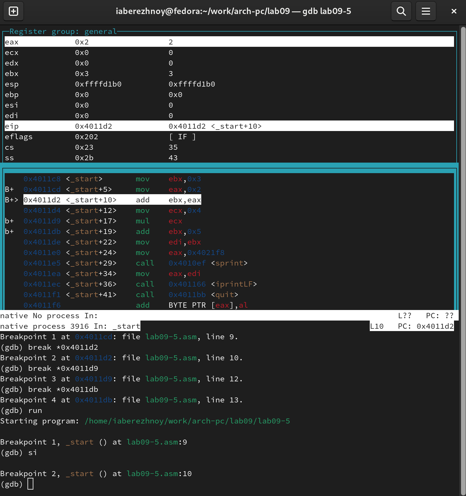
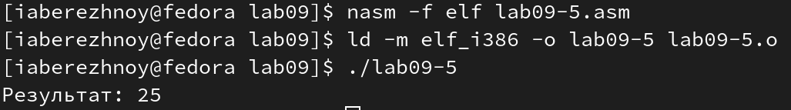

---
## Front matter
title: "Отчёт по лабораторной работе №9"
subtitle: "Дисциплина: Архитектура компьютера"
author: "Бережной Иван Александрович"

## Generic otions
lang: ru-RU
toc-title: "Содержание"

## Bibliography
bibliography: bib/cite.bib
csl: pandoc/csl/gost-r-7-0-5-2008-numeric.csl

## Pdf output format
toc: true # Table of contents
toc-depth: 2
lof: true # List of figures
lot: true # List of tables
fontsize: 13pt
linestretch: 1.5
papersize: a4
documentclass: scrreprt
## I18n polyglossia
polyglossia-lang:
  name: russian
  options:
	- spelling=modern
	- babelshorthands=true
polyglossia-otherlangs:
  name: english
## I18n babel
babel-lang: russian
babel-otherlangs: english
## Fonts
mainfont: PT Serif
romanfont: PT Serif
sansfont: PT Sans
monofont: PT Mono
mainfontoptions: Ligatures=TeX
romanfontoptions: Ligatures=TeX
sansfontoptions: Ligatures=TeX,Scale=MatchLowercase
monofontoptions: Scale=MatchLowercase,Scale=0.9
## Biblatex
biblatex: true
biblio-style: "gost-numeric"
biblatexoptions:
  - parentracker=true
  - backend=biber
  - hyperref=auto
  - language=auto
  - autolang=other*
  - citestyle=gost-numeric
## Pandoc-crossref LaTeX customization
figureTitle: "Рис."
listingTitle: "Листинг"
lofTitle: "Список иллюстраций"
lolTitle: "Листинги"
## Misc options
indent: true
header-includes:
  - \usepackage{indentfirst}
  - \usepackage{float} # keep figures where there are in the text
  - \floatplacement{figure}{H} # keep figures where there are in the text
---

# Цель работы

Приобретение навыков написания программ с использованием подпрограмм. Знакомство с методами отладки при помощи GDB и его основными возможностями.

# Задание

1. Реализация программ в NASM
2. Отладка программам с помощью GDB
3. Задание для самостоятельной работы

# Выполнение лабораторной работы

## Реализация программ в NASM
Создадим каталог для дальнейшего выполнения лабораторной работы. Перейдём в него и создадим файл lab09-1.asm (рис. @fig:001).

{ #fig:001 width=70% }

Скопируем код из предложенного листинга 9.1. (рис. @fig:002), создадим исполняемый файл и проверим его работу (рис. @fig:003).

{ #fig:002 width=70% }

{ #fig:003 width=70% }

Изменим текст программы, добавив подпрограмму, которая вычисляет значение выражения $f(g(x))$, где $x$ вводится с клавиатуры (рис. @fig:004). Создадим исполняемый файл и проверим его работу (рис. @fig:005).

{ #fig:004 width=70% }

{ #fig:005 width=70% }

## Отладка программам с помощью GDB
Создадим файл lab09-2.asm и скопируем в него листинг 9.2. (рис. @fig:006), затем создадим исполняемый файл, загрузим его в отладчик GDB и проверим его работу (рис. @fig:007).

{ #fig:006 width=70% }

{ #fig:007 width=70% }

Установим точку останова командой `break _start` и запустим программу (рис. @fig:008).

{ #fig:008 width=70% }

Посмотрим на дисассимилированный код программы командой `disassemble`, начиная с брейкпоинта. Теперь переключим отображение команд на Intel'овский синтаксис с помощью команды `set disassembly-flavour intel`, посмотрим и на это отображение (рис. @fig:009). Можем заметить различия: 
1. В отображении ATT имена регистров начинаются с символов % или $, в отличии от отображения Intel, где перед регистрами символов нет;
2. В отображении ATT другой порядок регистров, нежели в отображении Intel.

{ #fig:009 width=70% }

Включим режим псевдографики для удобного анализа программы командами `layout asm` и `layout regs` (рис. @fig:010).

{ #fig:010 width=70% }

Посмотрим, числится ли уже установленный нами брейкпоинт в списке точек останова командой `info breakpoints` (рис. @fig:011). Установим вторую точку останова по адресу инструкции. Для этого пишем команду `break *` и после символа звёздочки без пробела вводим адрес нужной нам инструкции (а именно `mov ebx,0x0`). Снова посмотрим список точек останова (рис. @fig:012).

{ #fig:011 width=70% }

{ #fig:012 width=70% }

Выполним команду `si 5`, которая позволит пошагово выполнять инструкции. Теперь посмотрим, какие регистры были изменены, сравнив их начальные значения (рис. @fig:013) с новыми (рис. @fig:014). Были изменены значения в регистрах `eax`, `ebx`, `ecx`, `edx`, `eip`, `cs`, `ds`, `ss`, `eflags` и `es`.

{ #fig:013 width=70% }

{ #fig:014 width=70% }

Посмотрим значение переменной `msg1` по имени с помощью команды `x/1sb &msg1`. Сделаем то же самое для переменной `msg2`, но уже по адресу (рис. @fig:015). Изменим первый символ переменной `msg1` командой `set {char}msg1='h' и посмотрим, сработали изменения. Также изменим первый символ и во второй переменной (рис. @fig:016).

{ #fig:015 width=70% }

{ #fig:016 width=70% }

Выведем значение регистра `edx` в различных форматах командами `p/F $<регистр>` (рис. @fig:017). 

{ #fig:017 width=70% }

Командой `set $ebx=<value>` изменим значение регистра ebx на '2', а затем на 2. Проверим значение после каждого его изменения (рис. @fig:018). Значения различаются, хотя мы ввели одинаковые числа. Тем не менее, в первом случае мы вводили число как символ, соответственно в качестве значения видим код этого числа (50). Во втором же случае мы вводим число как числовой тип данных, поэтому и получили то же самое число.

{ #fig:018 width=70% }

Завершим выполнение программы и выйдем из отладчика GDB.

Создадим файл lab09-3.asm и скопируем в него код из файла lab8-2.asm. Создадим исполняемый файл (рис. @fig:019). Теперь загрузим исполняемый файл в отладчик, попутно указав нужные аргументы (для этого также нужно использовать ключ `--args` (рис. @fig:020).

{ #fig:019 width=70% }

{ #fig:020 width=70% }

Установим брейкпоинт и запустим программу (рис. @fig:021). Посмотрим позиции стека через регистр `esp` командой `x/s *(void**)($esp + <value>`) (рис. @fig:022). Шаг изменения равен 4, т.к. шаг - int, под который выделяется 4 байта памяти.

{ #fig:021 width=70% }

{ #fig:022 width=70% }

## Задание для самостоятельной работы
1. Скопируем код программы из задания для самостоятельной работы (лабораторная работы №8) в файл lab09-4.asm. Перепишем код так, чтобы вычисление функции происходило в подпрограмме (функция соответствует варианту 2 из лабораторной работы №8) (рис. @fig:023). Создадим исполняемый файл и проверим его работу (рис. @fig:024).

{ #fig:023 width=70% }

{ #fig:024 width=70% }

**Листинг 9.1. Программа нахождения значения функции с использованием подпрограммы**
```nasm
%include 'in_out.asm'

SECTION .data
    msg db "Результат: ", 0

SECTION .text
global _start

_start:
    pop ecx
    pop edx
    sub ecx, 1
    mov esi, 0
    

next:
    cmp ecx, 0h
    jz_end
    pop eax
    call atoi
    call solve
    loop next
    
_end:
    mov eax, msg
    call sprint
    mov eax, esi
    call iprintLF
    call quit
    
solve:
    imul eax, 3
    sub eax, 1
    add esi, eax
    ret
```

2. Создадим файл lab09-5.asm и скопируем в него предложенный листинг 9.3 (рис. @fig:025).

{ #fig:025 width=70% }

Создадим исполняемый файл, загрузим его в отладчик GDB и проверим его работу (рис. @fig:026). Результат получился неверным. Установим несколько брейкпоинтов и пройдёмся по коду, учитывая изменения значений регистров (рис. @fig:027 и рис. @fig:028).

{ #fig:026 width=70% }

{ #fig:027 width=70% }

{ #fig:028 width=70% }

Очевидно, что присутствуют несколько ошибок, которые мы исправим (рис. @fig:029). Проверим работу программы (рис. @fig:030).

{ #fig:029 width=70% }

{ #fig:030 width=70% }

**Листинг 9.2. Исправленная программа, находящая значение выражения**
```nasm
%include 'in_out.asm'
SECTION .data
div: DB 'Результат: ',0
SECTION .text
GLOBAL _start
_start:
; ---- Вычисление выражения (3+2)*4+5
mov ebx,3
mov eax,2
add eax,ebx
mov ecx,4
mul ecx
add eax,5
mov edi,eax
; ---- Вывод результата на экран
mov eax,div
call sprint
mov eax,edi
call iprintLF
call quit
```

# Выводы

В ходе выполнения лабораторной работы мы приобрели навыки написания программ с использованием подпрограмм и познакомились с методами отладки при помощи GDB и его основными возможностями.

# Список литературы{.unnumbered}

::: [Архитектура ЭВМ](https://esystem.rudn.ru/mod/resource/view.php?id=1030557)
