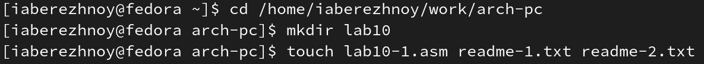
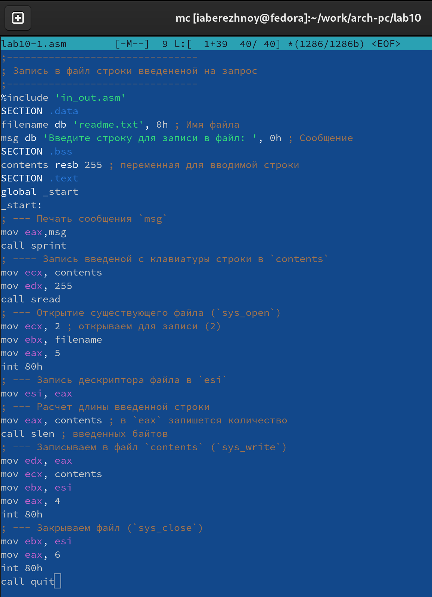
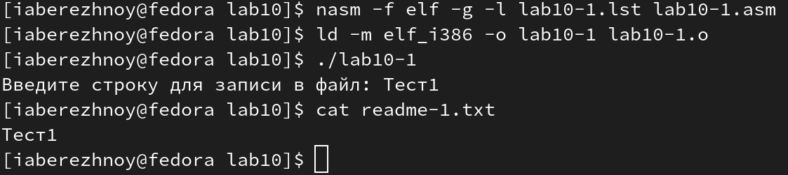
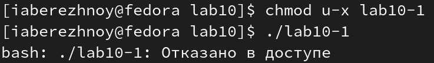
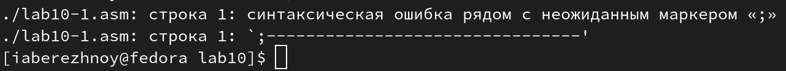
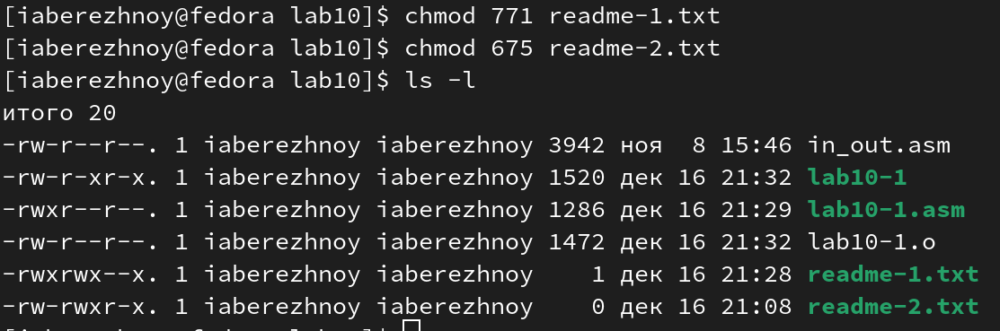
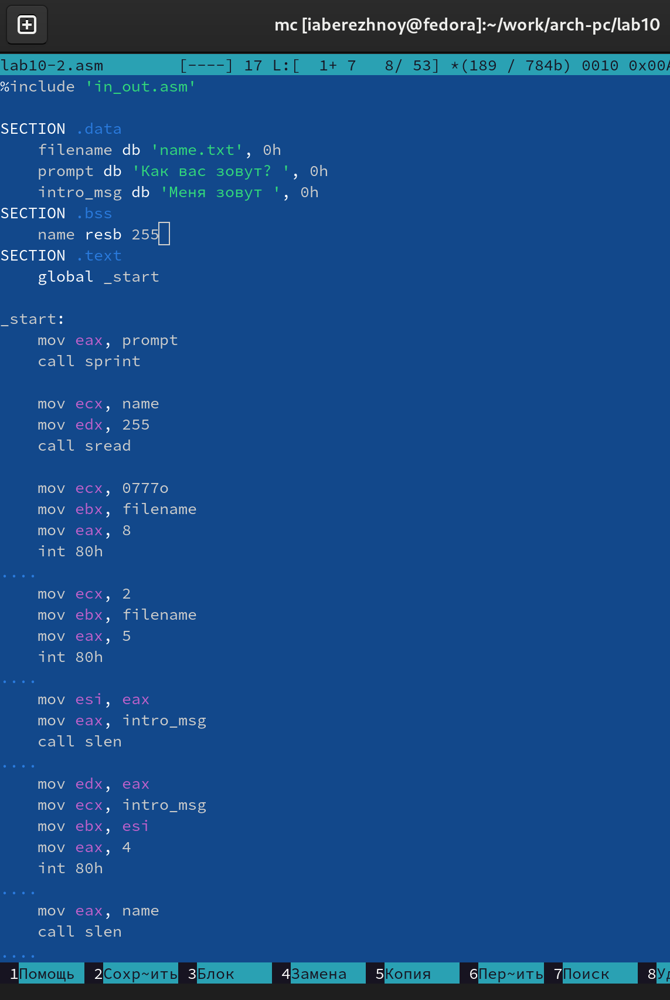
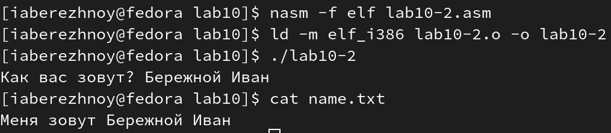

---
## Front matter
title: "Отчёт по лабораторной работе №10"
subtitle: "Дисциплина: Архитектура компьютера"
author: "Бережной Иван Александрович"

## Generic otions
lang: ru-RU
toc-title: "Содержание"

## Bibliography
bibliography: bib/cite.bib
csl: pandoc/csl/gost-r-7-0-5-2008-numeric.csl

## Pdf output format
toc: true # Table of contents
toc-depth: 2
lof: true # List of figures
lot: true # List of tables
fontsize: 13pt
linestretch: 1.5
papersize: a4
documentclass: scrreprt
## I18n polyglossia
polyglossia-lang:
  name: russian
  options:
	- spelling=modern
	- babelshorthands=true
polyglossia-otherlangs:
  name: english
## I18n babel
babel-lang: russian
babel-otherlangs: english
## Fonts
mainfont: PT Serif
romanfont: PT Serif
sansfont: PT Sans
monofont: PT Mono
mainfontoptions: Ligatures=TeX
romanfontoptions: Ligatures=TeX
sansfontoptions: Ligatures=TeX,Scale=MatchLowercase
monofontoptions: Scale=MatchLowercase,Scale=0.9
## Biblatex
biblatex: true
biblio-style: "gost-numeric"
biblatexoptions:
  - parentracker=true
  - backend=biber
  - hyperref=auto
  - language=auto
  - autolang=other*
  - citestyle=gost-numeric
## Pandoc-crossref LaTeX customization
figureTitle: "Рис."
tableTitle: "Таблица"
listingTitle: "Листинг"
lofTitle: "Список иллюстраций"
lolTitle: "Листинги"
## Misc options
indent: true
header-includes:
  - \usepackage{indentfirst}
  - \usepackage{float} # keep figures where there are in the text
  - \floatplacement{figure}{H} # keep figures where there are in the text
---

# Цель работы

Приобретение навыков написания программ для работы с файлами.

# Задание

1. Изучение основ работы с файлами и правами доступа
2. Задание для самостоятельной работы

# Выполнение лабораторной работы

## Изучение основ работы с файлами и правами доступа
Создадим каталог для дальнейшей работы, перейдём в него и создадим несколько файлов: lab10-1.asm, readme-1.txt и readme-2.txt (рис. @fig:001).

{ #fig:001 width=70% }

Скопируем в файл будущей программы lab10-1.asm предложенный листинг (рис. @fig:002). Создадим исполняемый файл и проверим его работу (рис. @fig:003).

{ #fig:002 width=70% }

{ #fig:003 width=70% }

С помощью команды `chmod u-x lab10-1` отменяем право у владельца на исполнение файла (рис. @fig:004). При попытке его исполнить появилась надпись "Отказано в доступе", чего мы и добивались. Так вышло, потому что в категории принадлежности мы указали `u` - владельца, а в качестве действия с правом `-x` - отменили право на исполнение.

{ #fig:004 width=70% }

Командой `chmod u+x lab10-1.asm` мы добавляем права на исполнение файлу lab10-1.asm. Попытаемся запустить его (рис. @fig:005) - получили ошибку, так как файл не является исполняемым и, соответственно, какие бы мы права ему не дали, это не сделает его таковым.

{ #fig:005 width=70% }

Выбираем свой вариант (в моём случае №2) и приступаем. Для файла readme-1.txt Нужно предоставить следующие права, представленные в символьном виде: rwx rwx --x, а для файла readme-2.txt - в двоичном: 110 111 101. С помощью команды `chmod` выполняем задачу и проверяем работу командой `ls -l` (рис. @fig:006). Успешно.

{ #fig:006 width=70% }

## Задание для самостоятельной работы
Напишем программу (рис. @fig:007) по предложенному алгоритму:
• Вывод приглашения “Как Вас зовут?”
• ввести с клавиатуры свои фамилию и имя
• создать файл с именем name.txt
• записать в файл сообщение “Меня зовут”
• дописать в файл строку введенную с клавиатуры
• закрыть файл
Проверим работу программы, введя своё имя и фамилию с последующей проверкой содержимого файла (рис. @fig:008). Программа работает корректно.

{ #fig:007 width=70% }

{ #fig:008 width=70% }

# Выводы

В ходе выполнения лабораторной работы мы приобрели навыки написания программ для работы с файлами.

# Список литературы{.unnumbered}

::: [Архитектура ЭВМ](https://esystem.rudn.ru/mod/resource/view.php?id=1030558)
